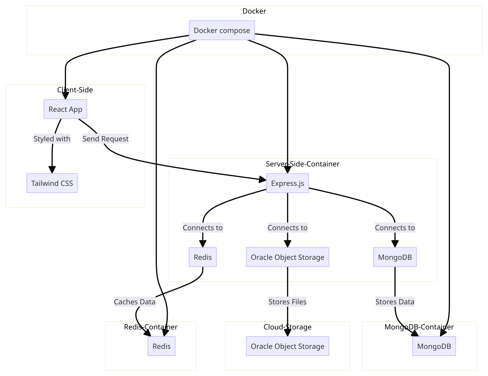

# E-Learning Platform

Welcome to the E-Learning Platform repository! This project is designed to provide a comprehensive and user-friendly platform for online education. Whether you are a student looking for courses or an instructor wanting to create and manage content, my platform aims to cater to your e-learning needs.

## Features

- **User-friendly Interface**: An intuitive interface designed for a seamless learning experience.
- **Courses and Modules**: Easily create, manage, and enroll in courses and modules.
- **Multimedia Content**: Support for diverse content types, including videos, documents.
- **Scalable Architecture**: Built with scalability in mind, ensuring a smooth experience as the platform grows.
- **Testable Code**: Prioritizing testability to ensure robust and maintainable code.
- **Well-documented Code**: Extensive documentation to assist developers in understanding and contributing to the codebase.

## Technology Stack

- **Client-Side**: React, Tailwind CSS, Redux
- **Server-Side**: Express.js, JWT (JSON Web Tokens)
- **Databases**: MongoDB, Redis
- **Object Storage**: Oracle Object Storage
- **Hosting**: Oracle Compute Server
- **Web Server**: Nginx
- **Collaboration**: Trello
- **Containerization**: Docker Compose


## Architecture Diagram



## Get started

To get started with the project locally, follow the instructions

1. First clone repository
```
git clone https://github.com/amgadfikry/codutopia.git
```
2. Choose mode you want to start with by change this line in docker compose file in main directory
- test for testing server mode
- dev for develpomental mode
- prod for production mode
```
 environment:
      - NODE_ENV=[mode]
```
3. Start Docker compose file by run this command if you do not have docker and docker-compose  install it from official website
```
docker-compose up -d
```
4. Start you app in browser useing link
```
http://localhost:5173
```
5. If you want look on server logs and watch it use
```
docker-compose logs -f client server
```
6. After finish you can destroy you container by
```
docker-compose down
```
## Contributing

Thank you for considering contributing to my E-Learning Platform! Contributions are welcome from everyone.

### Bug Reports and Feature Requests

If you come across a bug or have a feature request, please open an issue on our [GitHub repository](https://github.com/amgadfikry/e-learning-platform/issues). I appreciate your feedback and will address issues promptly.

### Pull Requests

I welcome contributions through pull requests. Here's a basic guide to help you get started:

1. Fork the repository.
2. Clone your forked repository: `git clone https://github.com/your-username/codutopia.git`
3. Create a new branch for your changes: `git checkout -b feature/your-feature`
4. Make your changes and commit them: `git commit -m "Add your feature"`
5. Push your changes to your forked repository: `git push origin feature/your-feature`
6. Open a pull request on our [GitHub repository](https://github.com/amgadfikry/e-learning-platform/pulls) with a detailed description of your changes.

### Development Setup

If you want to set up the development environment locally, follow the steps outlined in the [Get started](#get-started) section of the README.

### Code Style

Please follow the existing code style and conventions in the project. If your contribution introduces new code, make sure it adheres to the project's coding standards.

### Testing

If your contribution involves changes to functionality, consider adding or updating tests to cover the changes. Run existing tests to ensure your changes do not break existing functionality.

### Code Reviews

All contributions go through a review process. Be prepared to address feedback and make necessary changes before your contribution is merged.

## Roadmap

My future plans include:
- **Enhance Frontend UI/UX**: Continuously improve the user interface and user experience to provide a more visually appealing and intuitive platform.
- **Add Reviewing Course**: Introduce a course review feature, allowing students to provide feedback and ratings for courses.
- **Add Payment and Pricing**: Implement a payment system and introduce pricing plans to support monetization and financial sustainability.
- **Add Quizzes and Assessments**: Enhance the learning experience by incorporating quizzes and assessments to gauge student understanding and progress.
- **Add Built-in Code Editor**: Integrate a built-in code editor to provide a hands-on coding experience for courses that involve programming.
- **Dark Theme**: Introduce a dark theme option for users who prefer a darker interface.
I am excited about these upcoming features and welcome contributions and feedback from the community.


## License

This project is licensed under the [MIT License](./LICENSE). Feel free to use, modify, and distribute the code as per the terms of the license.

Thank you for your interest in My E-Learning Platform!
